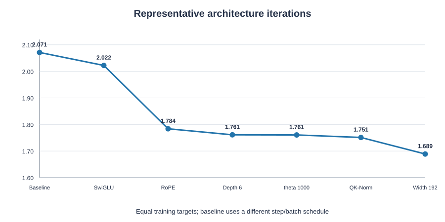
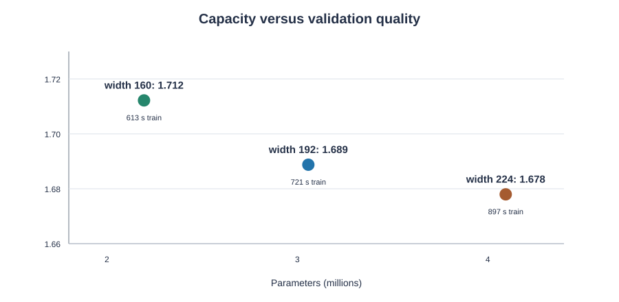
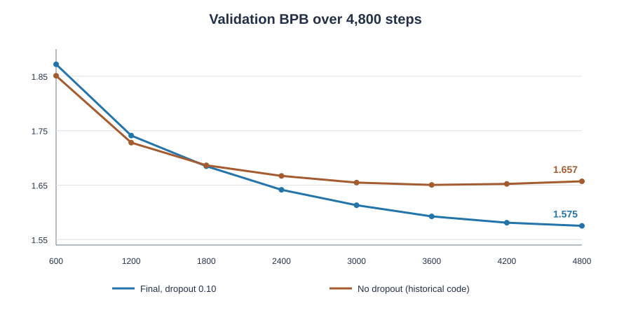

# DASE7506 MP1: Architectural Improvements and Experimental Analysis of a Small GPT


## Abstract

This project trains a small GPT from random initialization under the course-provided WikiText-2, BPE-2048, and 256-token causal-window protocol. The original baseline achieves **2.1013** bits per byte (BPB) on the full test split. The frozen final model achieves **1.5993**, a **23.89%** reduction.

The final model combines SwiGLU, RoPE, head-wise Q/K LayerNorm, and 0.1 residual dropout with width 192 and depth 6. It was trained for 4,800 steps with batch size 32, a 200-step warmup, and cosine learning-rate decay. Its CPU scoring time is 1.65 times the baseline; peak evaluation RAM is 2.112 GiB, and uncompressed inference assets total approximately 11.82 MiB. All three measures meet the course limits.

## 1. Baseline and Final Model

The course ranks models by full-test FP32 CPU BPB, but model development and selection use validation only. The supplied data, tokenizer, evaluator, and independent causal-window protocol were left unchanged.

The table highlights the differences most relevant to the final model. Both models retain multi-head causal self-attention, residual connections, LayerNorm, and tied input/output embeddings.

| Component | Original baseline | Final model | Rationale |
|---|---|---|---|
| Main architecture | Width 128, 4 layers, 4 heads | Width 192, 6 layers, 6 heads | Increase capacity while keeping head dimension 32 |
| Feed-forward network | 4×width GELU MLP | SwiGLU with hidden size 512 | Add input-dependent gating |
| Position encoding | Learned absolute position vectors | RoPE, θ=10000 | Represent relative position in attention |
| Attention Q/K | No additional normalization | Separate LayerNorm within each head | Control Q/K scale |
| Residual dropout | 0 | 0.10 | Address late-stage validation deterioration |
| Parameters | 1,088,256 | 3,057,792 | Approximately 2.81× baseline |
| Training | 1,200 steps, batch 32 | 4,800 steps, batch 32 | More updates; warmup extended from 100 to 200 steps |

The final run processed 39,321,600 training targets, compared with 9,830,400 for the baseline. Thus, the difference between their **final scores** measures the combined architecture and training recipe, not the effect of a single component.

For an equal-target comparison, the baseline's validation BPB after 9,830,400 targets was **2.0711**. At the same target count, the final recipe's intermediate step-1,200 checkpoint achieved **1.7410**. The new recipe therefore had an advantage at this budget. However, the two runs used schedules with different total horizons, so this is not an architecture-only ablation.

## 2. Representative Iterations

Figure 1 shows the principal architecture choices at an equal training-target budget. The baseline reaches this budget with 1,200 steps × batch 32; most subsequent architecture screens use 2,400 steps × batch 16. The connecting line shows the exploration sequence, not a series of strictly single-variable experiments.



| Stage | Representative change | Validation BPB | Interpretation |
|---|---|---:|---|
| Baseline | Original GPT | 2.0711 | Initial reference |
| Feed-forward network | Introduce SwiGLU | 2.0222 | Common backbone for the RoPE comparison |
| Position encoding | Replace learned positions with RoPE on the SwiGLU backbone | 1.7837 | Clearest single-mechanism gain in this project |
| Depth | Increase from 4 to 6 layers | 1.7611 | Added capacity helps |
| Attention normalization | Add Q/K LayerNorm to an intermediate θ=1000 configuration | 1.7510 | Small gain; retained |
| Width | Use width 192 on the preceding configuration | 1.6888 | Useful quality–cost balance |
| Final training | Width 192, θ=10000, dropout 0.1, 4,800 × 32 | **1.5752** | Checkpoint selected on validation |

The final row uses a different training budget. The change from 1.6888 to 1.5752 must not be attributed entirely to dropout. RoPE θ=1000 was an intermediate setting during the Q/K-normalization and width screens; the final configuration returned to θ=10000. The complete search history remains in `code/run_log.csv`, while this report focuses on runs relevant to the final choice and key ablations.

## 3. Methods and Experimental Evidence

### 3.1 SwiGLU Feed-Forward Network

The baseline uses a GELU MLP in each Transformer block. SwiGLU was considered because its gate can modulate information channels according to the input, rather than applying an activation to just one projection.

In `code/student.py`, `SwiGLU` computes `out(SiLU(gate(x)) × value(x))` and replaces the block MLP. Causal attention, residual paths, and the model interface remain unchanged.

At an equal target budget, the early SwiGLU configuration achieved **2.0222** BPB versus **2.0711** for the baseline. Batch size and update count differed, so the entire gap cannot be assigned to SwiGLU. The later RoPE ablation holds the SwiGLU backbone fixed.

### 3.2 RoPE Position Encoding

A learned absolute position table must infer relationships among positions from training data. RoPE rotates Q and K by their positions before attention, making their comparison sensitive to relative displacement.

`RotaryEmbedding` precomputes sine and cosine values; `SwiGLUBlock.forward` applies them to Q and K within each head. When RoPE is enabled, `StudentGPT` removes the learned position table. In the width-128, context-256 ablation, this removes exactly **32,768** parameters.

The key paired experiment fixes seed 17, width 128, depth 4, SwiGLU, batch size 16, 2,400 steps, and the number of processed targets. Only position encoding changes. Validation BPB falls from **2.0222 to 1.7837** (−0.2384). This is the main evidence for retaining RoPE, within the scope of this dataset, architecture, and training budget.

### 3.3 Q/K Normalization and Model Capacity

In deeper or wider models, changes in Q/K scale can make attention distributions overly sharp. The implementation applies a separate `nn.LayerNorm(head_dim)` to Q and K within each head, then applies RoPE. The precise name for this implementation is **head-wise Q/K LayerNorm**.

In a paired θ=1000 comparison, adding this normalization reduces validation BPB from **1.7605** to **1.7510**. The 0.0095 improvement warrants another seed before being treated as robust. The final model retains the component but uses θ=10000.

Capacity was selected through a width sweep with fixed seed, 2,400 steps, and batch size 16. Widths 160, 192, and 224 use 5, 6, and 7 heads respectively, keeping head dimension at 32.



| Width | Parameters | Training time | Validation BPB |
|---:|---:|---:|---:|
| 160 | 2.195M | 613 s | 1.7122 |
| **192** | **3.058M** | **721 s** | **1.6888** |
| 224 | 4.094M | 897 s | 1.6780 |

Increasing width from 192 to 224 adds about 1.036M parameters for a further 0.0108 BPB improvement, so width 192 was selected. With width fixed at 192, head dimensions 16/32/48/64 yielded 1.6968/1.6888/1.6899/1.6886 BPB. The advantage of 64 over 32 was negligible, and the final model uses 32.

### 3.4 Dropout and Learning-Rate Schedule

In a historical 4,800-step run without dropout, validation BPB reached **1.6504** at step 3,600 but rose to **1.6570** at the final step. This suggested that generalization could deteriorate during longer training, motivating regularization of the residual branches.

The code applies `nn.Dropout(p)` after the attention output projection and after the SwiGLU output, before each residual addition. Dropout acts only during training and adds no inference parameters.

In a 2,400-step, batch-32 ablation, p=0/0.05/0.10 produced **1.6545/1.6483/1.6521** BPB. The short-run optimum was 0.05; 0.10 was also slightly better than zero.

The final run uses p=0.10 for 4,800 steps. It uses AdamW with β₁=0.9 and β₂=0.999, a peak learning rate of 0.001, a 200-step warmup, and a cosine factor that gradually reduces the rate thereafter. This retains the baseline's warmup-times-cosine form, while changing the warmup length and overall schedule horizon.



The final run was evaluated every 600 steps, improving from **1.8719** at step 600 to **1.5752** at step 4,800. The no-dropout curve in Figure 3 has the same model size, seed, batch size, and total steps, but a different code-version hash. It is therefore a useful historical near-control, not proof that the entire final-score gap was caused by dropout.

## 4. Final Results and Limitations

### 4.1 Test Result and Resource Use

The model was frozen after validation-based selection and then scored on the complete test split. Its test BPB is **1.5993**, a 23.89% reduction from the baseline's **2.1013**.

| Metric | Baseline | Frozen model | Limit or interpretation |
|---|---:|---:|---|
| Validation BPB | 2.0711 | **1.5752** | Used for selection only |
| Full-test BPB | 2.1013 | **1.5993** | 23.89% reduction |
| CPU FP32 full-test scoring | 5.844 s | 9.624 s | 1.65×, below the 5× limit |
| Peak evaluation RSS | — | 2.112 GiB | Below 4 GiB |
| Uncompressed inference assets | — | About 11.82 MiB | Below 64 MiB |
| Parameters | 1.088M | 3.058M | About 2.81× |

CPU scoring times come from complete test runs on the same machine. The 2.112 GiB figure is a separately measured peak process RSS. The scoring JSON's `peak_allocated_gb=0` only means no GPU memory was allocated during CPU evaluation; it does **not** measure CPU RAM.

The inference-asset total includes the checkpoint, model implementation, configuration, and tokenizer, but not training logs. Final training took about **2,636 seconds**. The search log contains 26 training runs, 22 of which have recorded times; these recorded CPU-run wall times sum to at least **6.43 hours**, a lower bound on the full search cost.

### 4.2 Critical Analysis

#### Comparisons were not uniformly controlled

Batch size, update count, learning-rate schedule, and code version changed between some stages. The paired RoPE ablation is relatively clear. The baseline-to-final difference reflects the full recipe and cannot be decomposed by simply adding presumed gains from each component.

#### Small gains lack multi-seed confirmation

Most choices used seed 17. The 0.0095 BPB gain from Q/K normalization and the 0.0108 BPB gain from increasing width from 192 to 224 may be sensitive to randomness. The current evidence does not establish that either difference is stable.

#### The best dropout rate for long training remains untested

The 2,400-step comparison favored p=0.05, while the final 4,800-step run used p=0.10. The choice was motivated by late validation deterioration in the long no-dropout run, but a matched 4,800-step p=0.05 run under the same code and schedule is still missing.

#### Learning-rate components were not isolated

Warmup and cosine decay were used together in the final run, while training duration also changed. The available experiments cannot identify their individual effects. Fixed-learning-rate AdamW β₂ comparisons do not establish the independent contribution of warmup either.

#### Cost and follow-up experiments

The final model uses more parameters, training time, and CPU scoring time than the baseline. With further budget, the most informative next experiment would compare p=0, 0.05, and 0.10 under one code version and the same 4,800-step schedule. A second seed would also help verify small gains beyond RoPE. Any further selection should continue to use validation only.

### 4.3 Reproduction and Frozen Artifacts

From `code/`, reproduce training with:

```bash
python train.py --implementation student \
  --config configs/student_swiglu_rope_width192_head32_theta10000_qknorm_dropout010.json \
  --device cpu --threads 4 --seed 17 --steps 4800 \
  --eval-every 600 --save-every 600 \
  --run-dir runs/reproduce-final-dropout010-s4800-s17
```

Evaluate the frozen checkpoint without retraining:

```bash
python evaluate.py \
  --checkpoint runs/lr-verify-warmup200-cosine-dropout010-s4800-b32-s17/checkpoint.pt \
  --device cpu --threads 4 --precision fp32 --split test
```

The frozen checkpoint SHA-256 is `04f8d2c00a70d528b2a3b31de3ad3717cca93c18df616550f69cb59645bacbfa`; the matching `student.py` SHA-256 is `47477124058e73a234d60d75af31af1d80e12d3a89d4cb1c1f831e7ae0ee27e5`. Keep both artifacts together so the submitted model can be scored without retraining.

## 5. AI Assistance

AI tools assisted with improvement planning, controlled and ablation experiment design, code implementation, result organization, and report drafting. All numerical results are based on saved project runs.
